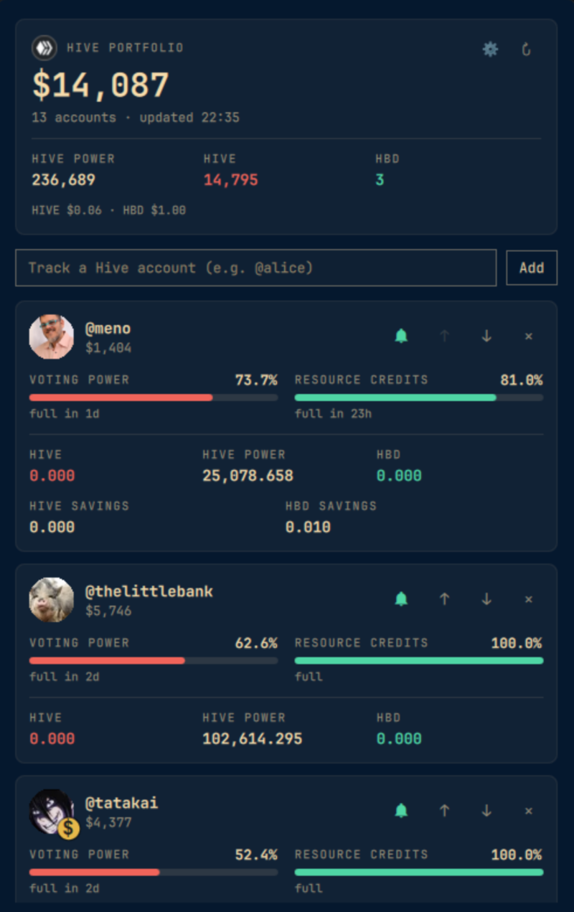
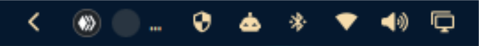

# Hive Portfolio for Omarchy

A bar widget for the [Omarchy](https://omarchy.org) shell that keeps an eye on your
[Hive](https://hive.io) accounts: balances, Hive Power, voting power (VP) and resource
credits (RC), for as many accounts as you like. It never touches keys. Everything it
reads is public blockchain data.



## What you get

- **A tiny rotating avatar in the bar.** It shows one account at a time with its voting power
  and moves to the next account every 10 seconds.
  
- **`$` badge** on an avatar when that account has unclaimed rewards.
- **Full voting power alert.** When an account is at 100% VP, mana is being wasted. Its avatar
  gets a pulsing orange ring, and the Hive logo pulses while another account is showing, so
  you notice whichever avatar is on screen. Accounts at 100% also get every other slot in the
  rotation.
- **Desktop notifications** shortly before VP is full (default 30 minutes) and when it is full.
  Each account is announced once, not on every refresh.
- **Per-account bell.** Mute alerts (notification, pulse and extra rotation slots) for accounts
  you don't care to curate with.
- **Portfolio panel** (click the widget): total USD value, Hive Power / HIVE / HBD totals and,
  per account: avatar, USD value, VP and RC bars with time to full, balances, savings and
  unclaimed rewards. Add, remove and reorder accounts right there.
- **Settings in the panel** (⚙): notifications, heads-up time, pulse, rotation priority,
  rotation speed and refresh interval. No files to edit.

Middle-click the widget to refresh now. Hover it for a summary of every account.

## Install

```sh
omarchy plugin add https://github.com/menobass/omarchy-hive-portfolio.git --enable
```

Pick the bar section when asked (right is the default). Then click the widget, type a Hive
username and press Enter.

Or by hand:

```sh
git clone https://github.com/menobass/omarchy-hive-portfolio.git \
  ~/.config/omarchy/plugins/io.github.menobass.hive-portfolio
omarchy plugin enable io.github.menobass.hive-portfolio right
```

Requirements: Omarchy with the Quickshell-based shell, and `notify-send` (libnotify) for
notifications. Internet access is needed for data and avatars.

## Remove

```sh
omarchy plugin remove io.github.menobass.hive-portfolio
```

Your settings stay behind so a reinstall picks up where you left off. To delete them too:

```sh
rm -f ~/.config/omarchy/hive-portfolio-accounts.json ~/.config/omarchy/hive-portfolio-state.json
```

## Where your data lives

| File | Contents |
|------|----------|
| `~/.config/omarchy/hive-portfolio-accounts.json` | tracked accounts, muted accounts, settings |
| `~/.config/omarchy/hive-portfolio-state.json` | which VP alerts were already announced |

Both are plain JSON and are written by the panel. You normally never need to open them.

## Network access

All requests are read-only and carry no credentials:

| Service | Used for |
|---------|----------|
| Hive API nodes (`api.hive.blog`, `api.deathwing.me`, `anyx.io`, `api.openhive.network`) | account data, RC, global properties, median price. Tried in order. |
| `images.hive.blog` | avatars |
| `api.coingecko.com` | HIVE/HBD price, only if the on-chain median price is unavailable |

The plugin runs no scripts, installs nothing and needs no elevated privileges. The only
program it launches is `notify-send`, with a fixed argument list.

## How the numbers are worked out

- **Hive Power** is your own stake converted from vests. Delegations in or out do not count
  towards the USD value.
- **Voting power and RC** are regenerated up to the current moment (5 days from 0% to 100%),
  not just the value at the last block that touched the account. Voting mana is sized on
  effective vests (own, minus delegated out, plus delegated in).
- **USD** uses the on-chain median price for HIVE and treats 1 HBD as $1. It includes savings
  and unclaimed rewards.

## Settings

All of these are in the panel (⚙). For reference:

| Setting | Default |
|---------|---------|
| Notifications | on |
| Heads-up before full | 30 min (0 = off) |
| Pulse when VP is full | on |
| Show full accounts more often | on |
| Switch avatar every | 10 s |
| Refresh data every | 5 min |

If you set `accounts`, `notify`, `alerts`, `prioritizeAlerts`, `warnMinutes`, `rotateSeconds`
or `refreshInterval` on the widget's entry in `~/.config/omarchy/shell.json`, they act as the
starting values until you change them in the panel.

## Troubleshooting

- **Widget shows `add`**: no accounts yet. Click it and add one.
- **Widget shows `err`**: none of the Hive nodes answered. Hover for the
  message. It retries on the next refresh, or middle-click to retry now.
- **No avatar, just a letter**: that account has no avatar or the image server is unreachable.
- **No notifications**: check the Notifications switch and the account's bell, and that
  `notify-send "test"` works.
- **Edited the plugin and nothing changed**: the shell caches QML, so run `omarchy restart shell`.

## Credits and license

Code: [MIT](LICENSE). The panel design follows
[hive-pocket-buddy](https://github.com/menobass/hive-pocket-buddy).

The Hive logo (`assets/hive-logo.png`) is a Hive community brand asset and is not covered by the
MIT license. It is included to identify Hive; see the Hive brand guidelines before reusing it.
